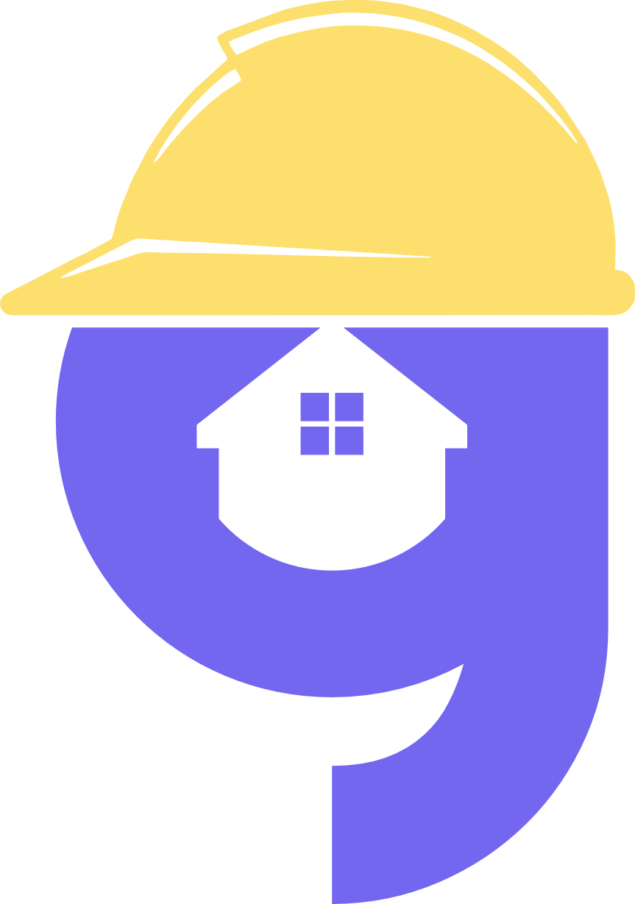

# GMOB - Sistema de Gestão Imobiliária

<p align="center">
  
</p>

<p align="center">
  <strong>O GMOB é uma plataforma completa e moderna para a gestão de imobiliárias, desenvolvida com as tecnologias mais recentes para garantir uma experiência de usuário fluida, responsiva e eficiente.</strong>
</p>

<p align="center">
  <a href="#-funcionalidades-principais">Funcionalidades</a> •
  <a href="#-tecnologias-utilizadas">Tecnologias</a> •
  <a href="#-estrutura-do-projeto">Estrutura</a> •
  <a href="#-começando">Começando</a>
</p>

---

## ✨ Funcionalidades Principais

O sistema foi projetado para atender às principais necessidades de corretores e administradores de imobiliárias, centralizando todas as operações em um único lugar.

* **Dashboard Analítico:**
    * Visão geral com as principais métricas do negócio: total de imóveis (disponíveis, vendidos, alugados), número de clientes, total de transações e Valor Geral de Vendas (VGV).
    * Gráfico interativo para visualizar a distribuição de imóveis por status.

* **Gestão de Corretores (Acesso Restrito):**
    * Funcionalidade exclusiva para administradores, permitindo o cadastro, visualização, edição e exclusão de corretores.
    * Tabela com paginação e filtros por data de cadastro.
    * Modais para adição e edição de corretores com validação de formulário e máscaras de entrada para CPF e telefone.

* **Gestão de Clientes:**
    * Cadastro completo de clientes com informações de contato, CPF e tipo de interesse (compra ou aluguel).
    * Filtros por tipo de interesse para facilitar a busca.
    * Opção para "arquivar" clientes em vez de excluí-los permanentemente, mantendo o histórico.
    * Visualização detalhada do perfil de cada cliente, incluindo o corretor responsável/page.tsx].

* **Gestão de Imóveis:**
    * CRUD completo para imóveis, com campos para endereço, valor, área, número de cômodos, status (disponível, vendido, alugado) e descrição.
    * Filtros avançados por status, estado e cidade.
    * Página de detalhes para cada imóvel, exibindo todas as informações, corretor responsável e ações contextuais/page.tsx].

* **Transações e Visitas:**
    * **Agendamento de Visitas:** A partir da página de um imóvel disponível, é possível agendar uma visita, associando um cliente, data e horário/page.tsx, src/components/agendarVisitaModal/index.tsx].
    * **Realização de Transações:** Permite registrar a venda ou aluguel de um imóvel para um cliente específico diretamente pela página do imóvel/page.tsx, src/components/realizeTransaction/index.tsx].
    * **Listagem de Visitas:** Uma página dedicada para visualizar todas as visitas agendadas, com detalhes do cliente, corretor e imóvel.

* **Autenticação e Perfil de Usuário:**
    * Sistema de login seguro com token JWT.
    * Rotas protegidas que garantem que apenas usuários autenticados possam acessar o sistema.
    * Página de perfil onde o usuário pode visualizar e editar suas próprias informações.

## 🚀 Tecnologias Utilizadas

Este projeto foi construído com uma stack moderna, focada em performance, escalabilidade e manutenibilidade.

* **Framework:** [Next.js](https://nextjs.org/) (com App Router)
* **Linguagem:** [TypeScript](https://www.typescriptlang.org/)
* **Estilização:** [Tailwind CSS](https://tailwindcss.com/)
* **Componentes UI:** [Headless UI](https://headlessui.com/) para modais e transições acessíveis.
* **Gerenciamento de Formulários:** [React Hook Form](https://react-hook-form.com/) com [Zod](https://zod.dev/) para validação de schemas.
* **Requisições HTTP:** [Axios](https://axios-http.com/) com interceptors para manipulação de token de autenticação.
* **Gráficos:** [Recharts](https://recharts.org/) para a criação de gráficos bonitos e responsivos.
* **Ícones:** [React Icons](https://react-icons.github.io/react-icons/)
* **Notificações (Toasts):** [React Toastify](https://fkhadra.github.io/react-toastify/introduction) para feedback visual ao usuário.
* **Máscaras de Input:** [React-IMask](https://imask.js.org/) para formatação de campos como CPF e telefone.

## 📂 Estrutura do Projeto

A estrutura de pastas foi organizada para promover a separação de responsabilidades e a escalabilidade.

/src
|
├── /app                    # Rotas da aplicação (App Router)
│   ├── /clientes           # Páginas de gestão de clientes
│   ├── /corretores         # Páginas de gestão de corretores
│   ├── /imoveis            # Páginas de gestão de imóveis
│   ├── /visitas            # Páginas de gestão de visitas
│   ├── page.tsx            # Página principal (Dashboard)
│   └── layout.tsx          # Layout principal da aplicação
|
├── /components             # Componentes React reutilizáveis
│   ├── /charts             # Componentes de gráficos
│   └── /table              # Componente de tabela genérico
|
├── /context                # Context API para estado global (ex: AuthContext)
|
├── /hooks                  # Hooks customizados para lógica de negócio (ex: useClientes)
|
├── /services               # Funções para comunicação com a API backend
|
└── /styles                 # Arquivos de estilo global


## 🚀 Começando

Para executar este projeto localmente, siga os passos abaixo:

1.  **Clone o repositório:**
    ```bash
    git clone https://URL_DO_SEU_REPOSITORIO.git
    cd NOME_DO_PROJETO
    ```

2.  **Instale as dependências:**
    ```bash
    npm install
    # ou
    yarn install
    ```

3.  **Configure o ambiente:**
    * Renomeie o arquivo `.env.example` para `.env.local`.
    * Adicione a URL da sua API no arquivo `.env.local`:
        ```
        NEXT_PUBLIC_API_URL=http://localhost:3000/api
        ```
    * *(Nota: O código atual usa uma URL fixa `http://localhost:3000/api` no arquivo `src/services/api.ts`. Recomenda-se mover isso para uma variável de ambiente)*.

4.  **Execute o projeto:**
    ```bash
    npm run dev
    # ou
    yarn dev
    ```

5.  Abra [http://localhost:3000](http://localhost:3000) em seu navegador para ver a aplicação.

---

